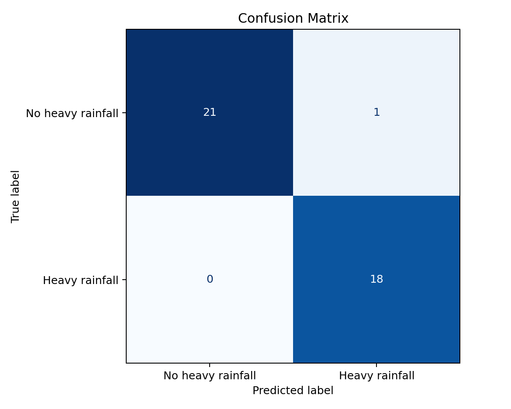
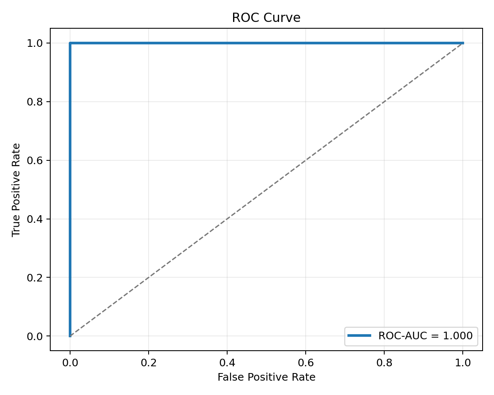
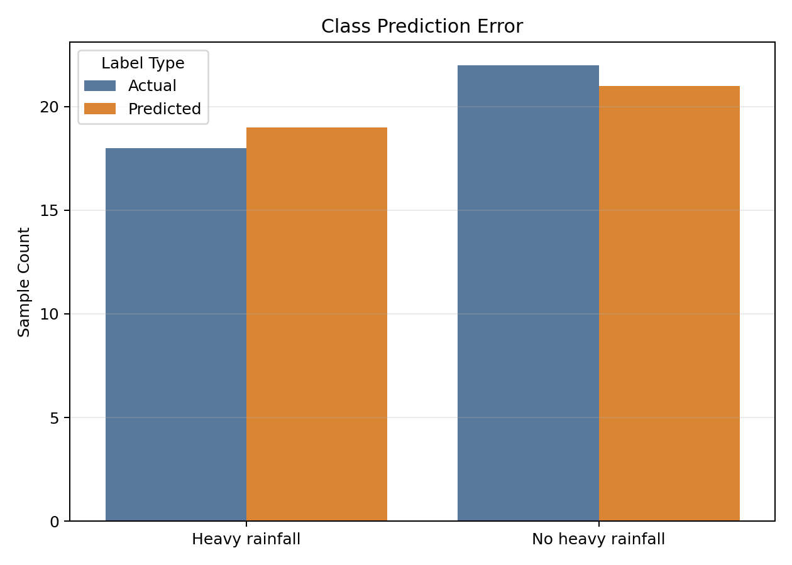
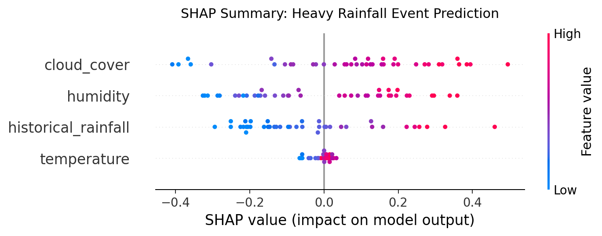

# Explainable AI for Heavy Rainfall Event Prediction

This repository contains a clean, reproducible research-code implementation for the topic:

**"Explainable Artificial Intelligence (XAI) for interpreting the contributing factors in heavy rainfall event prediction model."**

The project trains a Random Forest Classifier on a **synthetic meteorological dataset** and uses SHAP values to interpret which factors contribute most strongly to predicted heavy rainfall events.

## Research Abstract

Heavy rainfall events can create severe social, environmental, and infrastructure risks. Machine learning models can support early warning and disaster preparedness, but black-box predictions are difficult to trust in climate-risk workflows. This project demonstrates a transparent ML pipeline for binary heavy rainfall event prediction using synthetic observations of temperature, humidity, cloud cover, and historical rainfall. A Random Forest Classifier is evaluated with accuracy, precision, recall, F1-score, confusion matrix, and ROC-AUC. SHAP explainability is then used to analyze both global feature importance and local prediction behavior.

## Problem Statement

The goal is to predict whether a meteorological observation indicates a heavy rainfall event while explaining the factors behind each prediction. The project is designed for research presentation, resume review, and reproducible experimentation rather than operational weather forecasting.

## Dataset Description

The dataset is synthetic and contains 200 samples generated with a fixed random seed.

| Feature | Description |
| --- | --- |
| `temperature` | Synthetic air temperature value |
| `humidity` | Synthetic relative humidity value |
| `cloud_cover` | Synthetic cloud cover percentage |
| `historical_rainfall` | Synthetic recent rainfall amount |
| `heavy_rainfall_event` | Binary target: `1` for heavy rainfall event, `0` otherwise |

The target label is created from a transparent synthetic risk score. This keeps the project reproducible and avoids claiming access to real restricted meteorological measurements.

## Methodology

1. Generate a reproducible synthetic meteorological dataset.
2. Split the dataset into deterministic training and testing subsets.
3. Train a Random Forest Classifier.
4. Evaluate classification quality with standard metrics.
5. Visualize the confusion matrix, ROC curve, and class prediction error.
6. Use SHAP TreeExplainer to interpret feature contributions for the heavy rainfall class.

## Model Performance

Current deterministic held-out test results:

| Metric | Score |
| --- | ---: |
| Accuracy | 0.9750 |
| Precision | 0.9474 |
| Recall | 1.0000 |
| F1-score | 0.9730 |
| ROC-AUC | 1.0000 |

These values are obtained on the synthetic dataset and should not be interpreted as real-world forecasting performance.

## SHAP Explainability

SHAP values explain how each feature contributes to model predictions. In this experiment, global SHAP analysis identifies which meteorological factors most influence the model's heavy-rainfall classification. The summary plot shows both feature importance and whether high or low values push predictions toward the heavy rainfall event class.

## Results Screenshots

### Confusion Matrix



### ROC Curve



### Class Prediction Error



### SHAP Summary



## Folder Structure

```text
xai-heavy-rainfall-prediction/
├── README.md
├── requirements.txt
├── notebooks/
│   └── heavy_rainfall_xai.ipynb
├── src/
│   ├── generate_dataset.py
│   ├── train_model.py
│   ├── evaluate_model.py
│   └── explain_shap.py
├── outputs/
│   ├── confusion_matrix.png
│   ├── roc_curve.png
│   ├── class_prediction_error.png
│   └── shap_summary.png
├── data/
│   └── synthetic_rainfall_data.csv
└── docs/
    └── PROJECT_SUMMARY.md
```

## Installation

```bash
git clone https://github.com/tauqxxr7/xai-heavy-rainfall-prediction.git
cd xai-heavy-rainfall-prediction
pip install -r requirements.txt
```

## How to Run

Run the scripts from the repository root:

```bash
python src/generate_dataset.py
python src/train_model.py
python src/evaluate_model.py
python src/explain_shap.py
```

The generated plots are saved in `outputs/`.

## Future Scope

- Replace the synthetic dataset with verified meteorological station, radar, or satellite observations.
- Validate the model across different seasons, regions, and rainfall thresholds.
- Compare Random Forest with gradient boosting, logistic regression, and deep learning baselines.
- Add model calibration for probability reliability.
- Extend local interpretability with SHAP force plots for individual rainfall-event cases.
- Package the workflow as a small dashboard for disaster preparedness demonstrations.

## Citation Note

If this repository is used in academic writing, cite it as supporting research code for the paper topic and clearly mention that the included dataset is synthetic. Do not cite the reported metrics as real-world meteorological forecasting accuracy.

